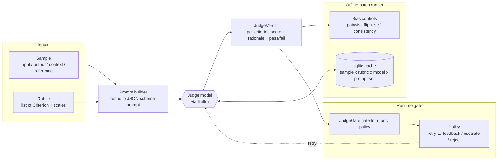

# judge-evals

Open-source **LLM-as-judge** evaluation harness: rubric-based scoring both **offline**
(batch evaluation, agreement vs. human labels) and as a **runtime gate** that judges an
agent/LLM output live and triggers retries on failure.

Judges run through [litellm](https://github.com/BerriAI/litellm), so any backend works —
a hosted API model or a local vLLM / ollama endpoint.

> Clean-room project. No proprietary code, prompts, or data.

## Architecture



## Quickstart

```bash
make setup     # uv sync --dev  (creates .venv, installs deps)
make test      # run the pytest suite
make lint      # ruff check + format --check
make run       # invoke the judge-evals CLI
```

Requires [uv](https://docs.astral.sh/uv/). Python 3.11+ is provisioned by uv itself.

Copy `.env.example` to `.env` and fill in provider keys for whichever judge backend you use.

